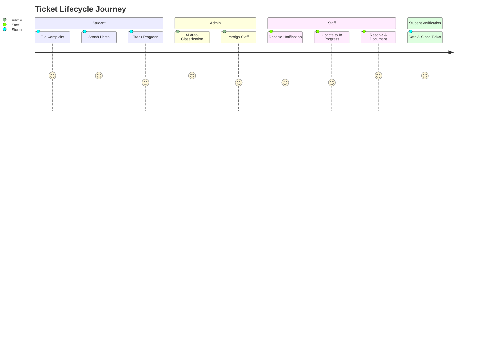

# Fixora: Product Discovery Document (Phase 0)

Fixora is an AI-powered hostel complaint and maintenance management platform designed to ensure that no hostel issue gets lost, ignored, or delayed. This document serves as the formal product blueprint for our stakeholders and engineering teams.

---

## 1. Product Vision
To establish Fixora as the premier, intelligent hostel maintenance ecosystem that guarantees transparency, eliminates manual processing delays, and transforms hostel complaint management into an efficient, automated, and student-centric digital experience.

## 2. Problem Statement
In traditional hostel environments, students face significant delays and a complete lack of transparency when reporting maintenance issues (e.g., broken fixtures, plumbing leaks, internet outages). The current manual workflows—such as physical logbooks, phone calls, or unmonitored email threads—suffer from several critical flaws:
- Complaints are frequently lost, ignored, or misrouted.
- Students have no way to track resolution progress in real time.
- Maintenance staff lack a centralized, prioritized task list.
- Hostel administrators have zero visibility into operational metrics, average resolution times, or staff performance.

## 3. Target Users
Fixora serves three core groups within the hostel ecosystem:
1.  **Students (Complaining Users)**: Residence hall students lodging complaints, tracking status, and verifying completion.
2.  **Hostel Maintenance Staff / Technicians (Resolving Users)**: Skilled workers (electricians, plumbers, carpenters, IT support) executing maintenance tasks.
3.  **Hostel Administrators / Wardens (Managing Users)**: Supervisors managing tickets, allocating resources, analyzing performance metrics, and managing system configurations.

---

## 4. User Personas

### Persona A: Aarav Mehta (The Student)
*   **Role**: 2nd Year Computer Science Student, residing in Hostel Block C.
*   **Context**: Busy schedule, smartphone-dependent, expects consumer-grade app experiences.
*   **Scenario**: Aarav returns to his room at 10 PM and finds his study lamp socket is sparking. He wants to lodge a complaint immediately with a photo and track it without having to walk to the warden's office.

### Persona B: Rajesh Kumar (The Maintenance Technician)
*   **Role**: Senior Electrician, Hostel Maintenance Department.
*   **Context**: Practical, hands-on worker; prefers simple, translation-friendly, high-contrast mobile user interfaces. Easily overwhelmed by complex software settings.
*   **Scenario**: Rajesh arrives at work at 8 AM. He needs to see a prioritized list of electrical issues, sorted by urgency and building location, and upload a "fixed" photo to close out each ticket.

### Persona C: Dr. Shanti Iyer (The Hostel Administrator/Warden)
*   **Role**: Chief Warden, Block A & B.
*   **Context**: Needs to oversee operations, prove efficiency to university leadership, and manage workload distribution.
*   **Scenario**: Dr. Shanti wants to identify why Block B has a 48-hour plumbing delay on average and which rooms have recurring water issues. She needs charts on average resolution time and staff workloads.

---

## 5. Pain Points
*   **Lack of Tracking**: Students do not know if their complaint has been read or when it will be fixed.
*   **Information Decay**: Key details (e.g., specific room numbers, exact location of leaks, urgency details) are lost when transcribed from paper logs.
*   **Inefficient Routing**: Administrators waste hours manually parsing paper sheets to assign tasks to appropriate technicians.
*   **Lack of Evidence**: Technicians go to rooms unprepared (e.g., bringing the wrong tools) because they cannot see the issue beforehand.
*   **No Accountability**: No digital timestamp audit trail; disputes arise over whether a complaint was actually resolved.

---

## 6. Goals
*   **Zero Paper**: 100% digitalization of the maintenance lifecycle.
*   **Accelerate TAT**: Decrease Ticket Turnaround Time (TAT) by 50% within the first month.
*   **Automated Classification**: Automatically categorize 90%+ of incoming tickets to correct domains (Plumbing, Electrical, etc.) using a modular AI engine.
*   **Continuous Feedback**: Achieve a minimum student satisfaction score of 4.2 / 5 stars post-resolution.
*   **Data-Driven Wardenship**: Provide real-time analytics to wardens for budget, asset, and staff allocation.

## 7. Success Metrics
*   **Mean Time to Resolution (MTTR)**: Reduced to < 12 hours for High-Priority issues.
*   **Reopen Rate**: Below 5% (complaints marked resolved that students reopen due to incomplete fixes).
*   **Staff Utilization**: Uniform distribution of tasks across maintenance staff.
*   **User Adoption Rate**: 95% of resident students using Fixora instead of offline methods within 30 days of launch.

---

## 8. Features (MVP Scope)
1.  **Dual Auth Portal**: Login credentials with Custom JWT-based authorization (supporting roles: Student, Staff, Admin).
2.  **Student Ticket Creation**: Form to input Title, Description, Room, Category, Priority, and upload an image.
3.  **Dynamic Ticket Board**: Kanban-style or filterable list showing tickets grouped by status: `PENDING`, `ASSIGNED`, `IN_PROGRESS`, `RESOLVED`, `VERIFIED`, `REOPENED`.
4.  **Supabase Storage Upload**: Direct media uploads for ticket registration and completion verification.
5.  **Staff Dashboard**: Simplified mobile-first view of assigned tasks.
6.  **Interactive Comment Thread**: Auditable history per ticket allowing Students, Staff, and Admins to message each other.
7.  **Auto-Classification Engine (Phase 1)**: Rule-based backend parser that reads ticket descriptions and auto-suggests category.
8.  **Closing Feedback**: A rating component (1-5 stars) and review text required for a student to close a resolved ticket.

## 9. Future Features
*   **LLM/NLP Engine**: Generative AI routing, auto-replying with troubleshooting steps for common issues (e.g., Wi-Fi router resets).
*   **Push Notifications**: Push messages on status changes using Web Push API.
*   **WhatsApp/SMS Integration**: Automated WhatsApp templates sent to technicians when high-priority tasks are assigned.
*   **Preventative Schedule Manager**: Set recurring inspections (e.g., water tank cleanings every 3 months).

## 10. Out-of-Scope Features
*   **Invoicing & Payment Processing**: Processing payments for spare parts or labor charges (all fixes are assumed to be covered by hostel fees).
*   **Room Allotment & Student Registration**: Room keys, room switches, and student roommate assignments (handled by the university's main Student Information System).

---

## 11. Functional Requirements
*   **FR-1: Custom Authentication**
    *   System must authenticate users using JWT tokens stored securely on the client.
    *   System must enforce Role-Based Access Control (RBAC) at the route and API levels.
*   **FR-2: Ticket Lifecycle Management**
    *   Students can create, view, comment on, and reopen/close tickets.
    *   Technicians can change status to `IN_PROGRESS` or `RESOLVED`, and post logs.
    *   Admins can reassign, override statuses, delete spam, and edit classifications.
*   **FR-3: Media Attachments**
    *   Image files must upload to Supabase Storage and link securely to the PostgreSQL record.
*   **FR-4: Audit Log & Comments**
    *   Every status change must be recorded with a timestamp and the user ID of the operator.

## 12. Non-Functional Requirements
*   **NFR-1: Security**
    *   All passwords must be hashed using `bcrypt` before database storage.
    *   API requests must require valid authorization headers containing custom JWTs.
*   **NFR-2: Performance & Latency**
    *   The frontend (Next.js) must load in less than 2.0 seconds on standard cellular connections.
    *   Backend API queries must respond within 300ms under standard loads.
*   **NFR-3: Scalability**
    *   The system must handle up to 2,000 active students and concurrent read/write queries without database deadlocks.
*   **NFR-4: Architecture**
    *   The system must maintain strict separation of concerns following Clean Architecture.
    *   Backend must decouple SQLAlchemy models from business entity schemas (using Pydantic models).

---

## 13. Risks
*   **Staff Resistance**: Staff may avoid using the digital app and rely on phone calls.
    *   *Mitigation*: Provide translation support, high-contrast large buttons, and run a 1-hour physical workshop.
*   **Vandalism/Spam Reports**: Students posting fake issues.
    *   *Mitigation*: Enforce email verification and log student details on every submission; limit maximum open tickets per student to 3.
*   **Supabase Resource Limits**: Reaching free-tier storage limits.
    *   *Mitigation*: Implement image compression before uploading (compress images on the client side).

## 14. Constraints
*   **Authentication Limitation**: No Supabase Auth is permitted. We must build and maintain our own custom JWT token generation, rotation, and verification logic.
*   **Infrastructure Hosting**: Next.js must be optimized for Vercel deployment. PostgreSQL and file storage must rely on Supabase instances.

## 15. MVP Definition
The MVP of Fixora is defined as:
*   A Next.js (Tailwind) web interface optimized for mobile and desktop, deployed on Vercel.
*   A Python REST API backend using SQLAlchemy and Alembic migrations against a Supabase PostgreSQL instance.
*   Custom JWT auth for Students, Staff, and Admins.
*   A complete ticket workflow: *Lodge (Student) -> Auto-classify / Assign (Admin) -> Update Status (Staff) -> Comment Thread -> Verify & Rate (Student)*.
*   Supabase Storage attachment links.
