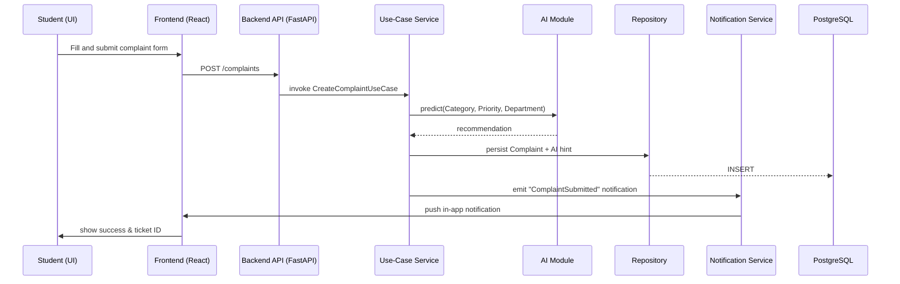

# 1. High-Level Architecture

Fixora is a **modular, layered system** that separates concerns between user‑facing UI, application logic, data persistence, AI assistance, and cross‑cutting concerns such as authentication, authorization, notifications and audit logging.  The high‑level view is illustrated below:

```mermaid
flowchart TB
    subgraph Frontend[Frontend (React)]
        UI[User Interface]
    end
    subgraph Backend[Backend (FastAPI)]
        API[REST API]
        Service[Business Services / Use‑Cases]
        AI[AI Recommendation Engine]
        Repo[Repository Layer]
        DB[(PostgreSQL DB)]
        Notif[Notification Service]
        Auth[Auth & RBAC]
        Audit[Audit Log Service]
    end
    UI --> API
    API --> Service
    Service --> AI
    Service --> Repo
    Repo --> DB
    Service --> Notif
    Service --> Auth
    Service --> Audit
```

The **Frontend** sends HTTP requests to the **API**.  The API forwards calls to **Use‑Case services** which orchestrate domain logic, invoke the **AI module** for recommendations, persist state via the **Repository** to **PostgreSQL**, emit **in‑app notifications**, enforce **JWT‑based authentication** and **RBAC**, and record **audit events**.

---

# 2. Architectural Style

Fixora follows **Clean Architecture / Hexagonal Architecture**.  The key benefit is *independence* – business rules do not depend on framework, UI, or external services, making future evolution (e.g., swapping the AI engine, adding new campuses) trivial.

| Layer | Responsibility |
|------|-------------------|
| **Presentation** | React UI, routing, UI state.  Calls the backend via HTTP. |
| **API** (Interface Adapters) | FastAPI routers, request/response models, input validation, translation to domain objects. |
| **Services / Use Cases** | Core business rules: complaint lifecycle, routing, supervisor review, maintenance updates. |
| **Repository** | Abstract persistence contracts; concrete implementation uses SQLAlchemy against PostgreSQL. |
| **Database** | Relational store for tickets, users, audit records, AI‑generated hints. |
| **AI Module** | Rule‑based engine that can later be replaced by an ML model; exposed through a clean interface used by the Service layer. |
| **Notification Module** | Generates in‑app notification events; designed for future email/SMS adapters. |

---

# 3. Request Flow

The typical flow when a **Student** creates a complaint:



**Supervisor Review** and **Maintenance Office** follow similar sequences, with the Service layer invoking the **Repository** to update status and the **Notification Service** to push updates to the Student UI.

---

# 4. Module Breakdown

| Module | Responsibility |
|--------|----------------|
| **Authentication** | Handles GIKI‑email login, issues JWTs, validates tokens on each request. |
| **Complaint Management** | CRUD operations for tickets, stores AI hints, tracks lifecycle state. |
| **Supervisor Management** | Assigns supervisors to hostels, enforces routing rules, provides UI for review/override. |
| **Maintenance Office** | Dashboard for forwarded complaints, status updates after receiving technician feedback, analytics view. |
| **Notifications** | In‑app push layer; abstracts to email/SMS adapters for future phases. |
| **Audit Logs** | Immutable record of every state change, AI prediction, override, and user action. |
| **Analytics** | Aggregates ticket metrics for the dashboard (open count, SLA compliance, etc.). |
| **AI Module** | Rule‑based recommendation engine; exposed via a simple interface (`predict(issue)`). |
| **Future Expansion** | Defined extension points (plug‑in architecture) for image handling, ML models, new campus services (laundry, visitor mgmt). |

---

# 5. Folder Structure

```
Fixora/
├─ docs/                     # Architecture, design, onboarding docs
├─ frontend/                 # React (UI) – src/, public/, assets/
│   ├─ src/
│   │   ├─ components/      # Reusable UI components
│   │   ├─ pages/           # Route‑level pages (ComplaintForm, Dashboard)
│   │   ├─ services/        # API client wrappers
│   │   └─ store/           # State management (e.g., Redux or Context)
│   └─ ...
├─ backend/                  # FastAPI (API) – app/, core/, adapters/
│   ├─ app/
│   │   ├─ api/              # Routers, request models
│   │   ├─ services/         # Use‑case implementations
│   │   ├─ repositories/     # Repository interfaces + SQLAlchemy impl.
│   │   ├─ ai/               # AI engine façade
│   │   ├─ notifications/   # Notification service & adapters
│   │   ├─ auth/             # JWT creation/verification, RBAC
│   │   ├─ audit/            # Audit logging utilities
│   │   └─ config/            # Settings (pydantic Settings)
│   └─ tests/               # Unit / integration tests
├─ ai/                      # Stand‑alone rule‑based engine (can be swapped later)
├─ database/                # Alembic migrations, seed data
└─ configs/                 # Secrets, env files (not checked‑in)
```

Each top‑level folder groups concerns: **frontend** is purely UI, **backend** houses the Clean‑Architecture layers, **ai** can be developed independently, and **database** isolates schema evolution.

---

# 6. Authentication Architecture

1. **Login Flow** – Student supplies GIKI email; the backend validates the email domain, creates a short‑lived **JWT** containing `sub` (user id) and `role` claim.
2. **JWT Validation** – Every request includes `Authorization: Bearer <token>`; FastAPI dependency extracts the token, verifies signature, checks expiration, and populates `current_user`.
3. **RBAC** – A lightweight decorator inspects `current_user.role` and matches it against a required role list (e.g., `Supervisor`, `MaintenanceOffice`).  The roles are:
   - **Student** – can create tickets, view own tickets, receive notifications.
   - **Hostel Supervisor** – can review, override AI, forward to Maintenance Office.
   - **Maintenance Office** – can update status, view all tickets for assigned hostels.
4. **Token Refresh** – (Future) endpoint can issue a new JWT based on a refresh token stored securely on the client.

---

# 7. AI Architecture

- The **AI Module** resides in `backend/app/ai/` and implements a single interface:
  ```python
  class AIEngine:
      def predict(self, description: str) -> Prediction:
          ...
  ```
- **Rule‑based engine** uses deterministic heuristics (keyword matching) to output `category`, `priority`, `department`.
- The **Service layer** calls `AIEngine.predict` during complaint creation; the result is stored as a *recommendation*.
- **Supervisor Override** – The UI shows the recommendation with editable fields; the Supervisor’s final values are persisted and marked as `override = true` in the audit log.
- **Future swap** – Replacing the rule‑based engine with an ML model only requires a new implementation of `AIEngine`; the rest of the system (services, repository) remains unchanged.

---

# 8. Notification Architecture

- **In‑app notifications** are stored in a `notifications` table with fields `user_id`, `type`, `payload`, `read_at`.
- The **Notification Service** publishes events (e.g., `ComplaintSubmitted`, `ForwardedToSupervisor`, `InProgress`, `Resolved`, `Reopened`, `AutoClosed`).  The service writes a row and pushes a WebSocket / Server‑Sent Event (SSE) message to the frontend.
- **Extensibility** – The service defines an `INotificationSender` interface.  Current implementation is `InAppSender`.  Future adapters (`EmailSender`, `SmsSender`) can be added without touching the Service layer.

---

# 9. Audit Logging

Every state‑changing action triggers an **audit record** (`audit_logs` table):
- `action` (e.g., `TicketCreated`, `AI_Prediction`, `SupervisorOverride`, `Forwarded`, `StatusUpdated`, `TicketReopened`, `TicketClosed`).
- `performed_by` (user id or system).
- `timestamp`.
- `details` (JSON snapshot of the before/after state).

Audit logs enable:
- **Traceability** for regulatory compliance.
- **Debugging** of problematic tickets.
- **Analytics** of how often AI is overridden.

---

# 10. Error Handling

| Category | Strategy |
|----------|----------|
| **Validation** | Pydantic models return 422 with field‑level messages. |
| **Authentication** | 401 responses for missing/invalid JWT. |
| **Authorization** | 403 when role lacks required permission. |
| **Server** | 500 with generic message; detailed stack trace logged internally. |
| **Database** | Catch `IntegrityError` → 409 Conflict (e.g., duplicate ticket). |
| **AI** | If prediction fails, fallback to `unknown` values and log warning. |

All errors are **logged** with correlation IDs to aid correlation between frontend and backend logs.

---

# 11. Security Architecture

- **JWT** signed with HS256 using a shared secret (`JWT_SECRET_KEY`) stored as an environment variable; tokens expire after 15 minutes to limit replay risk.
- **Password hashing** – Not applicable (GIKI email based) but future local accounts would use Argon2.
- **Environment variables** – Secrets (DB creds, JWT keys) loaded via `python‑dotenv` and never committed.
- **SQL Injection protection** – All DB access via SQLAlchemy ORM with bound parameters.
- **Role permissions** – Enforced centrally in the auth dependency.
- **Input validation** – Pydantic ensures proper types and sanitises strings.
- **HTTPS readiness** – Architecture assumes deployment behind an TLS‑terminating reverse proxy (e.g., Nginx).  All internal APIs are served over HTTPS.

---

# 12. Scalability

- **Modular layers** let us add new capabilities without touching core logic.  Examples:
  - **Image uploads** – New `Media` service added; repository gains a `MediaRepository` implementation.
  - **ML models** – Replace `AIEngine` implementation; no change to use‑cases.
  - **Multiple campuses** – Extend the `Hostel` domain model; routing logic picks the correct supervisor based on campus.
  - **Laundry / Parcel / Visitor modules** – New bounded contexts with their own services, repositories, and UI pages, all plugged into the existing API gateway.
- **Horizontal scaling** – Stateless FastAPI services can be replicated behind a load balancer; JWT eliminates session affinity.
- **Asynchronous tasks** – Future background workers (Celery, RQ) can handle heavy AI or notification dispatch without blocking request threads.

---

# 13. Design Decisions

| Decision | Chosen | Reason | Alternatives & Why Rejected |
|----------|--------|--------|----------------------------|
| **Architecture** | Clean/Hexagonal | Guarantees independence of UI, AI, DB; eases future swaps. | Monolithic MVC – would tightly couple UI and business logic, making future extensions painful. |
| **API framework** | FastAPI | Async, auto‑generated OpenAPI, great Pydantic validation. | Flask – less built‑in async support, more boilerplate for validation. |
| **AI implementation** | Rule‑based engine now | Immediate delivery, deterministic, no data needed. | Full ML pipeline – requires training data and longer ramp‑up; unnecessary for Phase 0.2. |
| **Notification channel** | In‑app only | Satisfies MVP, no external email/SMS costs. | Email/SMS now – adds third‑party integrations and compliance overhead early. |
| **Auth method** | JWT with GIKI email domain check | Works with existing university identity, stateless. | OAuth with external IdP – adds external dependency and admin overhead. |
| **Database** | PostgreSQL | ACID guarantees, strong relational features, easy migrations. | NoSQL (e.g., MongoDB) – would complicate relational queries needed for ticket joins. |
| **State machine** | Implicit via status enum + audit log | Simple, easy to visualise, fits MVP. | Formal BPMN engine – adds unnecessary complexity for Phase 0.2. |

---

# 14. Architecture Summary

The proposed architecture embraces **Clean Architecture**, ensuring that business rules (complaint lifecycle, routing, AI recommendation) remain insulated from frameworks, UI, and external services.  A **layered backend** (FastAPI → Services → Repositories) provides a clear separation of concerns, while **JWT‑based authentication** and **RBAC** enforce strict role boundaries (Student, Hostel Supervisor, Maintenance Office).  The **AI module** is a pluggable component that currently delivers deterministic recommendations but can later be swapped for a machine‑learning model without impacting the rest of the system.  **In‑app notifications**, **audit logging**, and **extensible service interfaces** lay the groundwork for future capabilities such as email/SMS alerts, image uploads, and additional campus modules.  This architecture therefore delivers a solid, maintainable foundation for Phase 0.2 while remaining flexible enough to scale to the broader vision of Fixora.
